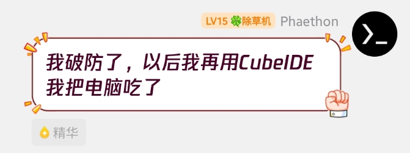
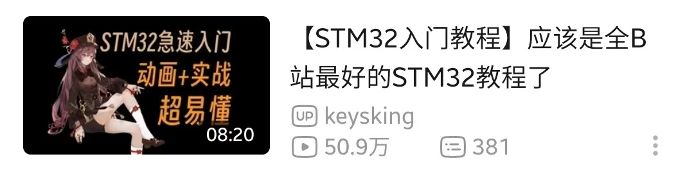

# 42
>
> **NVICBreak的秘密小窝**
>
> 此处作为我的个人博客使用，部分内容同步自微信朋友圈，不过为什么是**42**呢？
> 
> 大概，这里不会再更新了吧…

## 2025/12/6
Just one last dance

Before we say goodbye

When we sway and turn round and round and round

It's like the first time

## 2025/12/2
？？？：“那个你喜欢的氛围已经死了，或者它只存在于你的幻想里。”

## 2025/6/5

本教程暂定要写的全篇内容已经施工完毕，也在搬运教程的过程中，自己又重新学了一遍，发现了原版教程的不少错误，顺带加以纠正了。如果你喜欢本教程，记得在[Github页面](https://github.com/SUT-DTS/SUT-DTS.github.io)上点下**Star**，这是对我最大的鼓励。不过由于编写时间紧促，加之作者水平有限，本书中的疏漏错误一定还有不少，恳请广大读者若在发现问题后，能贡献出你那对我来说无比重要的PR，本人将不胜感激。

## 2025/5/25

::: details ...
最近状态不太好，摆烂了整整一个星期毫无任何产出，超电的开发也遇到瓶颈，不知道是不是热爱逐渐消退了。  
说起来，我是因为在高考假期无聊时无意间刷到了`mai_pico`舞萌小手台项目，想着正好假期有时间就想自己试试，由此才让我这个舞萌痴与嵌入式开发结下了纠缠之缘（  
说着容易做起来难，从毫无焊接基础到第一次焊好模块，焊上电容，接线理线，组装……第一次用嘉立创打样、BOM采购、第一次组装、烧录代码……一个小小的手台却融合了我太多的第一次（同时也真得感谢父母对我的理解与大力支持，为了实现我的小手台项目，前后花销大约有1700元），也是我在这个本来无聊的高考假期中最大的收获，我也大概永远忘不了第一次成功使用我做出来的手台操作游戏的那一晚。  
后来有幸了解到了RM，遇到了一群志同道合的伙伴，我认为我是幸运的，能够有机会与大家共同进步，一起凭借自己的热爱与努力，向更广阔的世界开拓知识，登上更广阔的舞台。  
如果只是为了混奖赚学分的话，我明明有更好的选择。  
可我仍然宁愿在这个战队里付出时间与精力，与队员一起每晚25点下班，是为了什么呢？我有对得起当初不顾一切也要完成任务成为正式队员的自己吗？我不知道。  
可能也有一部分原因要归结于学业压力上，可我深知我自己并不是一个很自律的人，每次想到这点，我都感到十分羞愧，却仍然无法迈出舒适圈。  
希望今天这份迷茫，能在不远的将来慢慢消散吧。  
不畏迷茫，就算迷茫也要前进！！  
希望下周能够找回以前的状态，继续努力吧！
:::

## 2025/5/24

其实本指导书一开始仅有STM32CubeIDE的环境配置教程，本人刚入队时学习的第一款IDE也是CubeIDE。
VSCode与CLion的教程写于2025/5/24，是时笔者刚刚经历（第三次）因为插件不兼容而导致的STM32CubeIDE崩溃（永久无法启动），ChatGPT在分析错误报告后含泪建议卸载重装（三回啊三回）。
至此笔者已然破防，愤而弃坑STM32CubeIDE，转战CLion。

## 2025/4/20

测英雄打弹，成功击毁一个灯罩，战绩可查😎

## 2025/3/27

我大概这辈子都忘不掉Ave Mujica了

## 2025/3/17

学校门口新开一家机厅？还有maimai？！我怎么会做这样的梦

## 2025/3/11

## 2024/12/9

::: details 一点校赛感想（梦开始的地方）
如果换做平时，老师如果叫我写点感想多少多少字以上的，我肯定就启动AI代写糊弄过去了。但在经历了不知几晚的熬夜之后，~~我还是打算AI启动（bushi）~~ 这次实在是有点真情实感是能够写下来的，本来是想接着commit到github上的，奈何比赛结束时就已经archive，于是就写在这里吧。  
首！先！**运气真的是实力的一部分啊**。其实预选赛的时候就已经能够看出来，绝大部分的队伍在八字环岛上完全是靠赌概率过的，小组循环赛的时候匹配到的对手也基本上能够决定自己能否晋级（这里就不得不提到某胡姓同学了，是真的可惜，摸摸），自己的车也是如此（沟槽的光电模块每天灵敏度随机刷新，愿天堂没有光电😇），暂且不提保几追几吧，光是已经被我写成史山的代码也就决定了我们的小车不得不依赖运气过的命运了……  
其次，我认识到**我所属的控制组才应该是全队中责任最重的那个。【事先说明我并没有说其他组成员比控制轻松，也没有捧自己的意思】** 在最后的调车过程中烧板子、掉线、重新做线、改车体结构、夹爪坏（虽然机械组哥们本来就不打算修吧，后面再说）……这些问题都得由我来把对应成员摇回来，如果摇不回来甚至还得我亲自上，比如这次为了解决光电过于灵敏的问题自己去改了车体结构，调车过程中爆出的各种零件也是我和另一位控制哥们装回去的，我们还为此特意带了螺丝刀组，~~所以说我猜控制组大概除了写代码什么都会~~（  
在这次比赛前，我从来不觉得努力开心过，“苦中作乐”也仅仅成为了一种口号。其实在比赛前几周我曾又过离开的想法，当时抱着“最后把校赛打完，打完我可能就不会去进MEIC”的想法，也很奇妙地造就了在比赛前两晚四点睡觉（第二天还早八），我认为我是一个很懒惰的人，但也仍然在比赛前一晚人生首次通宵的个人奇迹。大概是，**我这才是真正找到了的努力的意义吧**，深夜大家一起调车，一起交流的声画也给予了我“努力”的力量，这是我在此之前在应试教育中未曾体验到的，也是我所憧憬的一种环境，也是我最终决定留下来的重要原因，若没有“团队”这一动力支持我去真正为了自己所爱而努力的话，以后的样子我是不敢想的（  
不光是心里的感想，我的身体上也有很大的感（yi）想（jian），回来之后腿立马就酸了，上下铺都酸😂~~整个人处于一种硬直的状态~~。也是一定的，调车的时候一直在不断蹲下起立，为了调光电不知道在场地上阴暗地爬行了多长时间 ~~（不应该穿白衣服来的）看来写代码的也要有体力啊~~  
好像写了那么多，似乎也是该总结比赛的时候了，正如之前所说，**我队能在比赛中取得二等奖的成绩纯属是因为运气好！** ~~虽然其他队也可能这么说就是了~~……一开始车没出来之前我抱着太过理想化的想法写了一套理想中的控制代码，当然是不能运行的（甚至电机都动不了一下）。高端的控制往往采用最简单的实现方式，我最终选择了在死循环中使用if-else分支来实现光电模块电平变化读取，但这也导致了一个很严重的问题：代码逻辑可读性极差！最后的史山代码也证明了这一点。不过得益于HAL库的绝赞封装，我至少在调车时在没有注释的情况下也是能看懂代码逻辑的。我本来也写了一套夹爪取球的代码，但限于机械组成员的摆烂（直接放弃取球，怎么劝都没用），使得其没有调试机会，代码原型在我的repo的commit里，因为最后的完成代码中我将其删除了。  
既然提到了HAL库，就顺便也写一下我为什么会在中途突然选择转HAL库开发吧。一切起因是我在B站搜索STM32系列教程的时候，我发现大部分教程都有一个共同点：过于抽象、讲解虽细致但时间冗长，校赛在即，我开始更加迫切地寻找讲解通俗易懂，并且配有动画演示、课后练习的教程视频，这时我发现了keysking的教程系列：  
得益于优秀的动画演示，其对底层的讲解的易于理解、通俗易懂、而且几乎只需要一些基础的C语言知识，就能很快地上手，UP主在教程中力推HAL库，我也借此看到了HAL相比标准库在短时间内开发的效率优势，无需在花精力在引脚分配上去cv例程，开发效率上可以说是降维打击，也正是如此我才有更多的时间集中精力到光电模块寻迹的逻辑实现上（不然的话我的代码可能还连路都走不动）。赛后从结果看来，我认为我的选择是十分正确的。  
对于我们队来说，校赛的成绩我们是十分满意的，但这并不代表我们走到了终点，正如上文所说，我们仍有遗憾，我也希望在未来的努力中能够将其弥补。**感谢在比赛前一晚与我共同奋战至最后一刻的控制哥们XYD，在一些关键逻辑的实现上给予了我指导；感谢被我们控制组俩人从各种地方摇回来无数次的电路哥们WGH，这应该是我们组最累的成员了，电路板尝起来~~很好吃~~相当稳定，单片机板子烧掉时永远有备用板，以上我的队友们也相当努力，且很有实力，很高兴以后将有机会与他们共同奋斗！** 至于那个机械组的……本来还想写一段专门骂他的😅，我还是不踩一捧一了……他干的活随便换个人都能干，后期直接优化掉也丝毫不影响我们队其他……总之我的评价是：【万全部诗人】  
（这话就你最不该说😅）  
关于RC和RM两场比赛，其实我在此之前就已经去大致了解。比起任务驱动型的RC，我更想要去尝试偏重竞技性的RM。（因为我平时也比较喜欢玩一些竞技类游戏嘛……）  
既然留意已决，那么在日后我也必将去尝试不断地提升自己，与MEIC的大家一起为热爱而战，尽我自己所能为战队做出属于自己的贡献。  
Per Aspera Ad Astra.  
MEIC，加油！  
2024/12/9  
NVICBreak  
于宿舍温暖的小床上
:::
