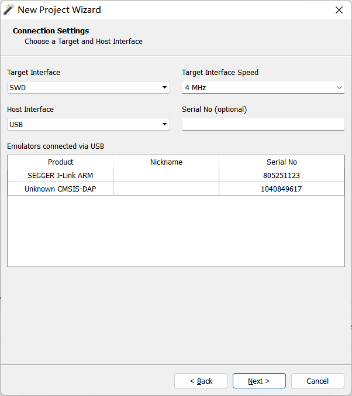

# Ozone - The J-Link Debugger
>
> Ozone 是 SEGGER 提供的一款功能全面的图形化调试器，支持对嵌入式应用的 C/C++/Rust 代码进行调试。它可与 J-Link 和 J-Trace 调试探针配合使用，支持程序追踪、性能分析和代码覆盖率分析，是一款强大的性能调试工具，适用于各种开发需求。
> Ozone仅支持J-Link，但某些特定版本也支持DAP-LINK，比如32位的V3.24

## 软件安装

1. [点击此处前往蓝奏云（访问密码：0721）](https://wwab.lanzouw.com/b00q0pih7a)下载其中所有文件；
   ::: warning
   经测试，仅V3.24版本支持DAP-Link调试
   :::
2. 下载完成后，双击`Ozone_Windows_V324_x86.exe`安装Ozone，在安装时请选择Install a new instance（安装一个新的实例），后续一路确认即可；
3. 接着双击`JLink_Windows_V722b.exe`安装JLink，在这一步注意不要勾选Update dll in other application，否则JLink会把Ozone里面老的驱动和启动项替代掉。Choose destination和Ozone一样，选择Install a new instance。如果安装了老的相同版本的JLink，请先卸载（版本相同不用管，直接新装一个）；
4. 将网盘上下载的`JLinkARM.dll`放到JLink和Ozone的安装目录下，替换原来的库。下载下来的库经过修改，使得J-LinkOB在使用的时候不会报“The JLink is defective"和”you are using a clone version“的错误。
   ::: tip
   之后如果安装其他版本的JLink，也请注意**不要勾选**Update DLL in other application，否则会替换掉修改过的动态链接库。
   :::

## 配置调试项目

1. 安装完两个软件后，即可启动Ozone，首次启动时将会显示一个New project wizard，选择M4内核，为了能够查看外设寄存器的值还需要svd文件，svd文件可以在[此仓库](https://github.com/cmsis-svd/cmsis-svd)中获取；
   ::: details 如果New project wizard没有打开...
   在工具栏的File-> New -> New project wizard。
   :::
2. 接口选择SWD，接口速度不需要太高，如果调试的时候需要观察大量的变量并且使用日志功能，可以调高这个值。如果连接了JLink，下面的窗口中会显示。如果链接了DAPLink，或无线调试器，会出现`Unknown CMSIS-dap`，单击选择你要使用的调试器，然后继续；
3. 选择构建之后生成的`.elf`文件（在项目文件夹下的`build`中），或是直接粘贴绝对路径，这是调试器专用的文件格式，对其内容感兴趣可以自行搜索细节。此外Ozone还支持`.bin` `.hex` `.axf`（最后一个是amr-cc，也就是keil的工具链会生成的）等格式；

## 启用FreeRTOS

如果你的代码使用了实时系统，在载入项目的时候Ozone会进行对应的提示。选择载入支持实时系统的插件即可，我们的项目是F4的板子，内核是Cortex-M4（CM4），因此选用`FreeRTOSPlugin_CM4.js`（输入的时候js后缀不用输）。 Ozone默认输入的命令似乎有误，需要手动修改（这好像和Ozone的版本有关，请留意）；
   ::: details 如果没有出现提示...
   请在console中输入下面的命令然后回车即可：

   ```js
   Project.SetOSPlugin(“plugin_name”)
   # plugin_name是启用的实时系统支持插件名
   # 我们要使用的命令是Project.SetOSPlugin ("FreeRTOSPlugin_CM4")
   ```

   :::
