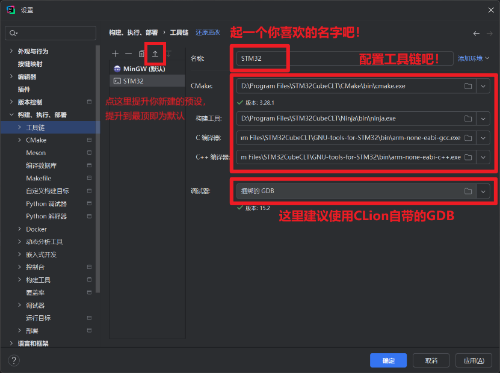

# CLion+STM32CubeMX
>
> **Why CLion?**
>
> 使用STM32CubeMX + CLion进行日常开发，相比于使用CubeIDE，你可以得到：
>
> 1. 更加美观可高度自定义的图形化界面；
> 2. 更加完善的社区和插件支持，包括git；
> 3. 软件使用过程中几乎不会出现任何恶性BUG；
> 4. 对FreeRTOS更加高级的调试支持；
> 5. 更强大的AI自动补全代码功能，以及可自定义的代码格式化；
>
> 但与此同时...你将会：
>
> 1. 调试过程中无法使用Live Expressions（现场表达式），这意味着你无法在IDE内部的调试界面动态观测变量值；
> 2. 占用更多的CPU和内存。

## 工具链与软件安装

### STM32CubeMX、STM32CubeCLT以及OpneOCD

参照[VSCode+STM32CubeMX部分教程](/教程/正文/IDE/VSCode.md)。

### CLion

1. [点击此处](https://www.jetbrains.com.cn/clion/)进入CLion官网，下载并安装CLion，在安装过程中，在此界面请将【更新PATH变量】、【更新上下文菜单】复选框都勾选，其余可参考自身需求；
2. 如果是第一次打开CLion，在完成语言和区域设置后，应该首先会弹出一个授权窗口，如下图所示。请选择【非商业使用】，并【登录以进行非商业使用】（或者注册）；
3. 在浏览器中完成账号登录后，就可以开始进行免费的非商业使用啦；

## 工程生成的配置

1. 欢迎来到CLion！首先让我们点击新建工程吧；
2. 在左侧的列表中找到STM32CubeMX，来到此界面，点击【启动STM32CubeMX】；
::: warning
如果你的STM32CubeMX和STM32CubeCLT没有安装在默认位置，那么你可能需要点击【编辑...】，并手动定位STM32CubeMX和STM32CubeCLT。
:::
3. 在STM32CubeMX中，像往常一样完成项目配置，最后在Project Manager中，检查以下项目，完成后即可点击右上角【GENERATE CODE】生成代码；
4. 将刚才复制的路径粘贴到CLion新建工程窗口的【位置】一栏中，点击【继续】完成工程创建；
5. 将会自动弹出【打开项目向导】窗口，首先推荐勾选CMake自动重载以避免每次手动重载，将预设修改为`Debug - Debug预设`；
   ::: tip
   图中选择的配置有误，请选择`Debug - Debug预设`，**同时将你新建的【工具链】置顶设为默认！（因为`Debug - Debug预设`不允许用户自己选择工具链）**
   :::

   ::: details 如何新建【工具链】？

   1. 点击【管理工具链】后，来到工具链管理页面，首先新建一个配置，选择【系统】；
   2. 按照下图，选择你刚刚安装的STM32CubeCLT中的文件完成工具链的配置，**然后将你刚刚新建的工具链置顶/设为默认**，完成后点击【应用】；
   3. 随后转到**构建、执行、部署→嵌入式开发**选项卡下配置嵌入式工具链，如图，选择OpenOCD、STM32CubeMX与STM32CubeCLT的安装路径，并确保右侧的【测试】全部通过；
   :::
6. <Badge type="warning" text="可选步骤" />转到**编辑器→检查**选项卡下，导入配置[CodeCheck.xml](https://github.com/SUT-DTS/SUT-DTS.github.io/blob/db7044fd90bd89034067e8a7a245372294fb69b9/CLion_dev_env/CodeCheck.xml)（可在本Github仓库中找到，或直接[点击下载](https://github.com/SUT-DTS/SUT-DTS.github.io/releases/download/Ver.CH1.10-B/CLion_dev_env.zip)）；
7. <Badge type="warning" text="可选步骤" />转到**编辑器→代码样式→C\C++** 选项卡下，导入配置[CodeFormat.xml](https://github.com/SUT-DTS/SUT-DTS.github.io/blob/db7044fd90bd89034067e8a7a245372294fb69b9/CLion_dev_env/CodeFormat.xml)（同样可在Github仓库中找到，或直接[点击下载](https://github.com/SUT-DTS/SUT-DTS.github.io/releases/download/Ver.CH1.10-B/CLion_dev_env.zip)）；
8. CLion内置GDB服务，并支持直接使用**JLink**或**STLink**进行烧录，不过我们需要来到【设置】中，根据下图所示的位置，手动将其开启；
   ::: warning
   在最新版CLion中，此选项文本已改为“为所有项目启用调试服务器”，同样需要勾选上。
   :::
   ::: tip
   同时，推荐在如下位置，开启【启用RTOS集成】，并在配置FreeROTS时开启相关设置，即可解锁更高级的FreeRTOS专用调试，可以更方便地查看每个线程的运行状态等信息；
   :::
9. 在上方菜单栏处，展开调试服务器选择，并【编辑调试服务器】；
10. 点击添加配置，可以看到CLion已经为我们准备好JLink或STLink下载器的相关配置文件，我们直接点选STLink后，右侧的一切保持默认，【确定】即可；
::: warning
如果要使用JLink，则需要在右侧手动指定GDB服务器和设备型号。
:::
11. 完成后，调试服务器应该会自动切换为你刚刚添加的STLink，这之后你就可以使用右侧的老三样按钮，狠狠滴开始嵌入式开发了；

## 如果要使用DAP-Link

1. ...比较可惜的是，CLion官方似乎还并没有内置DAP-Link下载器的配置，因此我们需要手动配置DAP-Link。首先来到本Github仓库中，将[daplink.cfg](https://github.com/SUT-DTS/SUT-DTS.github.io/blob/db7044fd90bd89034067e8a7a245372294fb69b9/CLion_dev_env/daplink.cfg)配置文件复制进工程根目录；
::: tip
实际上放哪都行，放根目录只是为了方便管理。
:::
2. 点开上方的【运行/调试配置】，点击【编辑配置】，在【添加新配置】的菜单中，选择【OpenOCD下载并运行】；
3. 进行如图所示的配置，修改途中两个红框所示的选项至图中所示，其中【面板配置文件】需要选择你刚刚复制进来的`.cfg`文件，或直接粘贴绝对路径，最后【确定】；
4. 在使用DAP-Link时，需要将【调试服务器】改回【原生】，之后你就可以正常使用右侧的老三样按钮了！同样的，如果需要使用STLink，则再将【调试服务器】改回【STLink】的同时，也别忘了将【运行/调试配置】改回默认！
::: warning
无论是选择VSCode还是CLion，其内置的调试工具都无法实现STM32CubeIDE中强大的Live Expressions（现场表达式）功能，需要借助其他软件（例如Ozone、Serial Port等）。不过另一种比较折中的方式是，你可以在第三方IDE中进行代码的编写，而仅在STM32CubeIDE中进行调试，相关配置方法请见[这一节](/教程/正文/IDE/CLion#仅使用stm32cubeide进行调试的配置)。
:::

## 如果要使用J-Link

> 下载J-Link驱动程序包：[官网下载](https://www.segger.com/downloads/jlink/)

运行配置请保持默认的**CMake应用程序**，调试服务器需要以下额外配置：“可执行文件”选择J-Link驱动程序包中的`JLinkGDBServerCL.exe`，**务必取消勾选“持久会话”！**


## CMakeLists.txt配置

> CMake 是一个跨平台构建系统生成工具。它并不是编译器本身，而是用来生成平台相关的构建脚本（如 Makefile、Ninja、MSBuild 等）的工具。借助CMake，我们可以很好地管理构建、模块化管理、引用头文件等。

1. 想必你也一定发现了，CLion的工程构建（编译）高度依赖于`CMake`，而`CMake`的配置文件由STM32CubeMX生成，并存放在项目根目录，其名为`CMakeLists.txt`；
2. 双击打开`CMakeLists.txt`，可见STM32CubeMX为我们生成的`CMakeLists.txt`文件非常整洁，注释完善。如果可以的话推荐自己阅读一遍注释，这样你基本就能够搞清楚其中每个段落的具体用法了；
3. 头文件与源文件加入构建的方法如下图所示，路径全部使用相对路径即可；
::: tip

- 对于源文件路径，有办法做到批量一键复制！首先将你想要添加的源文件都选中，然后右键打开菜单，并点击【复制路径/引用】；
- 在弹出窗口中选择【来自内容根的路径】，即可批量复制相对路径，随后直接在CMakeLists.txt中直接粘贴即可！
:::

## 导入STM32CubeIDE工程

1. 在工程文件夹中双击`.ioc`文件，用STM32CubeMX打开；
2. 将工具链修改为`CMake`后，直接点击生成，之后就可以用CLion打开了（用CLion打开文件夹）！

## 仅使用STM32CubeIDE进行调试的配置

1. 首先，我们需要我们要创建一个空壳工程作为STM32CubeIDE调试入口。按照[STM32CubeIDE教程](/教程/正文/IDE/STM32CubeIDE#项目基本配置)中记录的方法，轻车熟路地新建一个工程，进入.ioc文件后，不要进行任何修改；
2. 删除这两个文件夹以避免干扰；
3. 进入工程【首选项】，找到`C/C++ Build → Builder Settings`，取消勾选`Use default build command`；
4. 将下方的【Build command】修改为如下内容，完成后保存关闭：

   ```bash
   echo "No build required - using CLion"
   ```

5. 在 STM32CubeIDE 顶部菜单栏，点击**Run > Debug Configurations...**，在左侧展开`STM32 C/C++ Application`，右键点击 → `New Configuration`；
6. 在【Main】标签页下，【Project】选择`DebugWrapper`，C/C++ Applications需要粘贴你在CLion中编译出来的`.elf`文件的绝对路径；
::: warning
每次用 CLion 构建后，`.elf`路径要保持一致。
:::
7. 来到【调试器】标签页下，配置方法同[STM32CubeIDE部分教程（取决于你使用的下载器）](/教程/正文/IDE/STM32CubeIDE#使用dap-link下载、调试程序到单片机)，随后点击【应用】并【调试】，让STM32CubeIDE自动生成烧录脚本；
8. 跟之前一样，报错一次后，修改`.cfg`文件；
9. 配置完成！要进行代码调试时，先在CLion中【编译】，产生最新的`.elf`文件后，再来到STM32CubeIDE中，直接点击小锤子进行调试就好啦~
