# Keil uVision

::: danger 注意注意！
由于战队现已改用CLion作为队内统一IDE，本节现已不再更新/维护。请转到[CLion+STM32CubeMX](/教程/正文/IDE/CLion.md)

如果你是正在接受培训的新同学，请忽略此警告并在学习过程中使用`Keil uVision`
:::

> **Why Keil uVision?**
>
> ~~经典永不过时！（现在确实过时了）~~ Keil作为最知名的老牌嵌入式IDE，有着上手难度低，调试功能强大，适合新人学习使用的特点。以STM32为例，网上很多基础向教程都是基于Keil进行开发的。
>

## 软件安装

1. 点击[这里](https://www.keil.com/)进入官网，点击【Downloads】进入下载页面；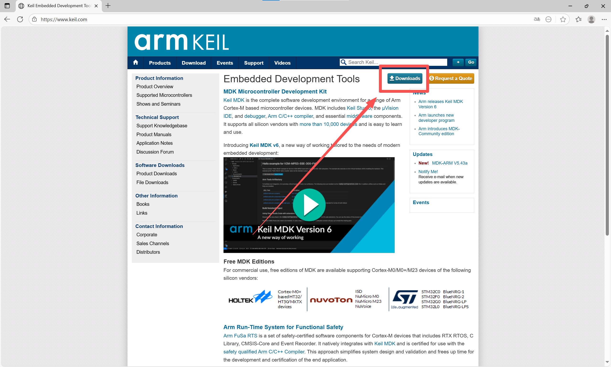
2. 随后点击【MDK-Arm】以下载MDK版本的Keil，以进行STM32开发；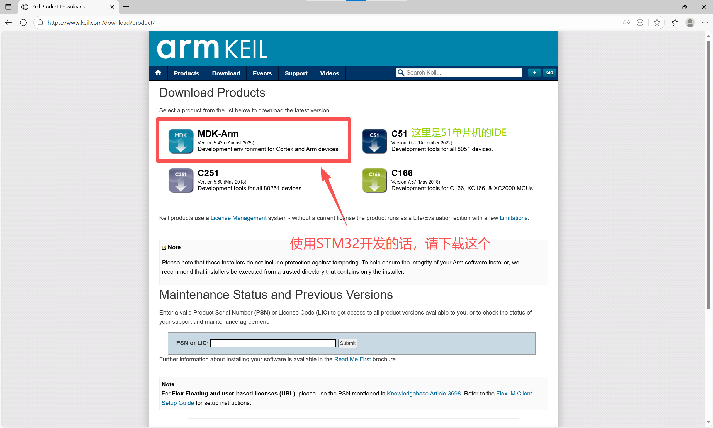
3. 之后如果是首次进入，将会出现一张信息收集表，无需填写真实信息，将表格填完后，【Submit】即可；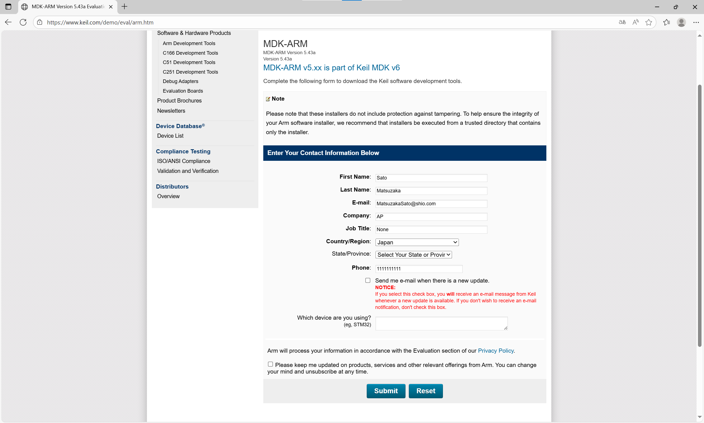
4. 提交后，将会出现下载页面，点击页面中最大的那个蓝链即可开始下载！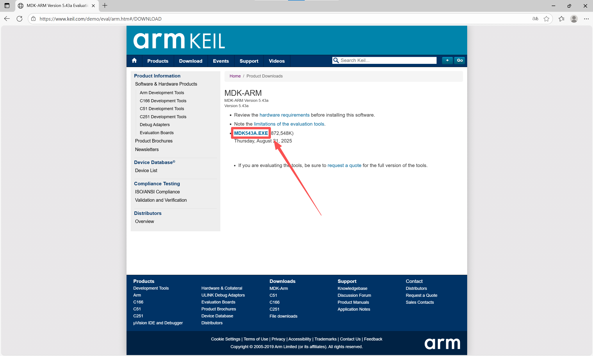
5. 下载完成后的安装包长这样，双击打开它；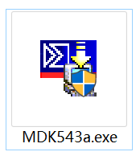
6. 随后进入安装过程，同意协议后来到选择安装路径界面，上方路径为软件安装位置，下方路径为资源包下载位置，此处建议均保持默认；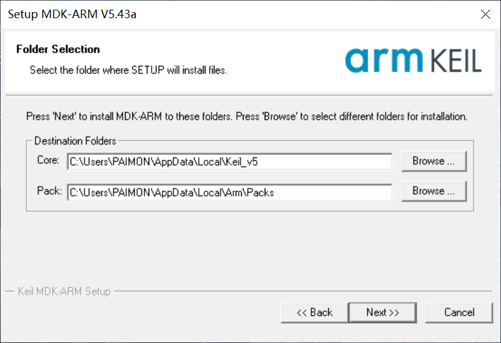
7. 接下来来到信息收集页面，无需填写真实信息，填满即可下一步；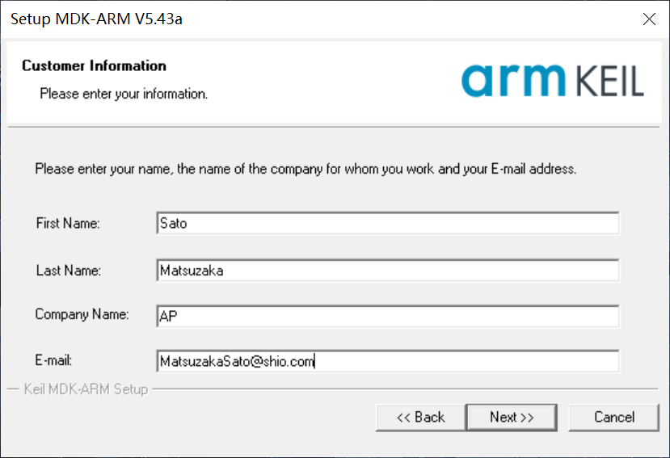
8. <Badge type="danger" text="重要"></Badge> 直到弹出如图所示的安装完成的窗口前，**不要进行任何操作**，否则可能打断软件包或驱动的正常安装，如果杀毒软件拦截了任意安装，请放行；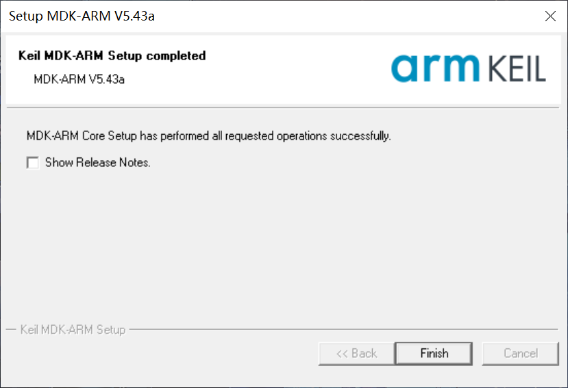
9. 安装完成后，可能会弹出如下图所示的Pack Installer界面，待右下角进度条走完消失后，即可关闭这个窗口；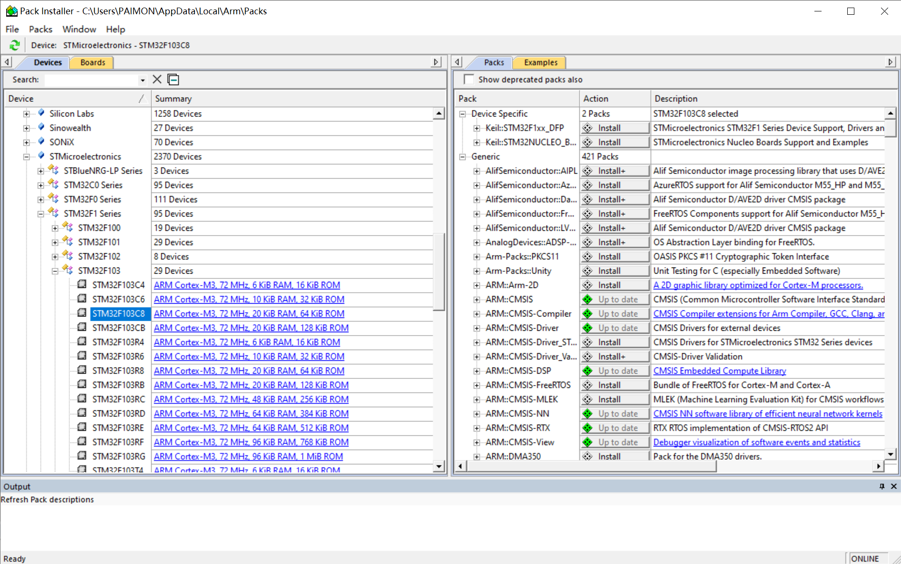
10. 随后，你可以在你的桌面上找到安装好的Keil！

## 软件激活

> Keil作为付费软件，其未注册版本限制了可编译的代码大小不超过`2kb`，这远远不能满足我们单片机开发的日常使用需求。
> 
> 好在，你现在可以通过两种方式来免费激活Keil，两种方式在激活完成后没有任何使用上的区别。**请在以下两种方式中任选一种方法激活你的Keil。**

### 激活 Arm Keil MDK-Community Edition（推荐）

> 原文链接：https://www.keil.arm.com/mdk-community/

1. 此方法无需使用管理员身份运行Keil，直接双击打开即可，打开后，依次点击左上角的【File】→【Liscense Management】，并在弹出的窗口中切到【User-Based License】；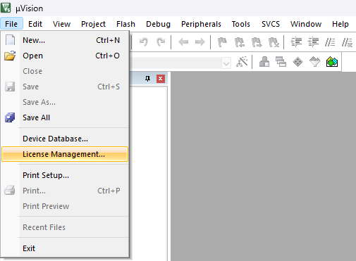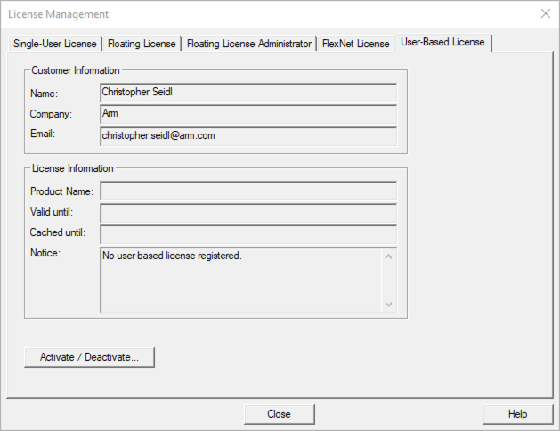
2. 点击下方的【Activate / Deactive...】按钮后，将打开【Arm License Management Utility】，如下图所示；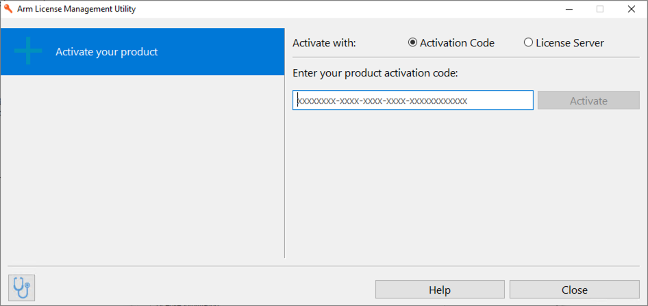
3. 在右上角，点击选择【License Server...】，随后，在输入框内填入`https://mdk-preview.keil.arm.com`后，点击【Query】，之后在出现的下拉菜单中选择【Keil MDK Community...】然后点击右侧的【Activate（激活）】；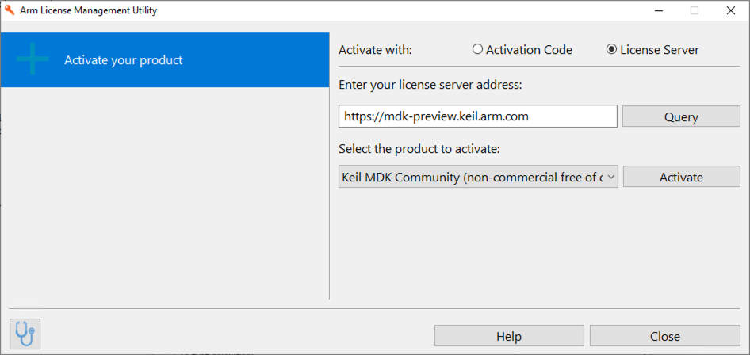
4. 至此，Keil已完成激活，接下来可以关闭所有窗口，返回Keil了！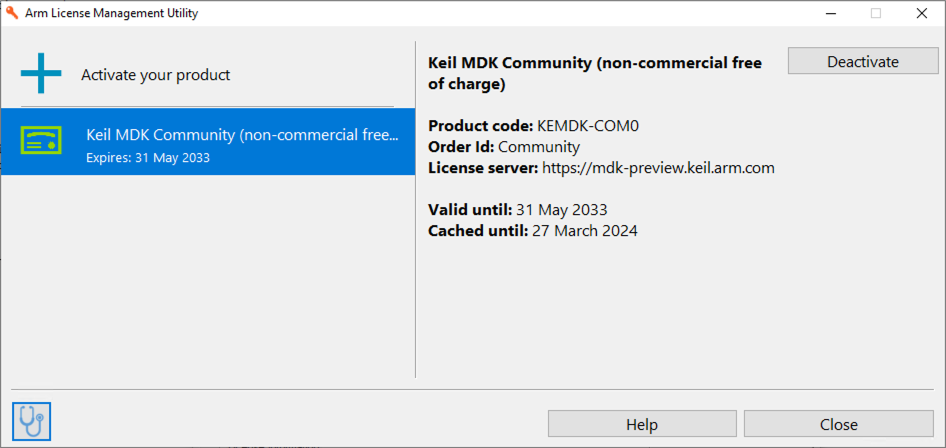

### 激活 MDK-ARM PLUS

::: danger
**使用此方法激活的 Keil uVision5 仍然为未经授权的盗版软件，相关软件仅供学习交流，请勿用于商业用途，下载后请于24小时内删除。**
:::

1. [点击这里（提取码：MEIC）]( https://pan.baidu.com/s/124QLWAvMcswC_8Z90HCCag?pwd=MEIC)下载注册机；
2. **右键使用管理员身份运行Keil**，打开后，依次点击左上角的【File】→【Liscense Management】；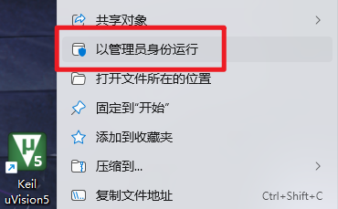
3. 在右上角，复制下你自己的CID备用；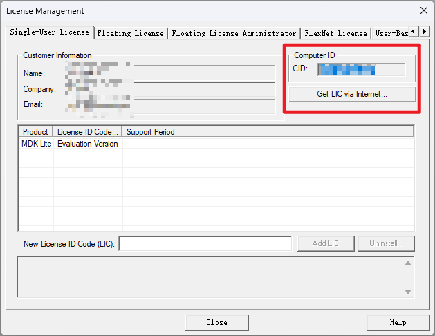
4. 双击打开你刚刚下载好的注册机，它长这样：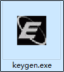
5. 填入你的CID，Target选择`ARM`，随后点击`Generate`，即可生成激活码，将它复制下来；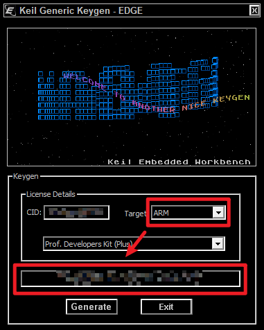
6. 回到Keil，将你刚刚复制的激活码填入，点击【Add LIC】即可完成激活！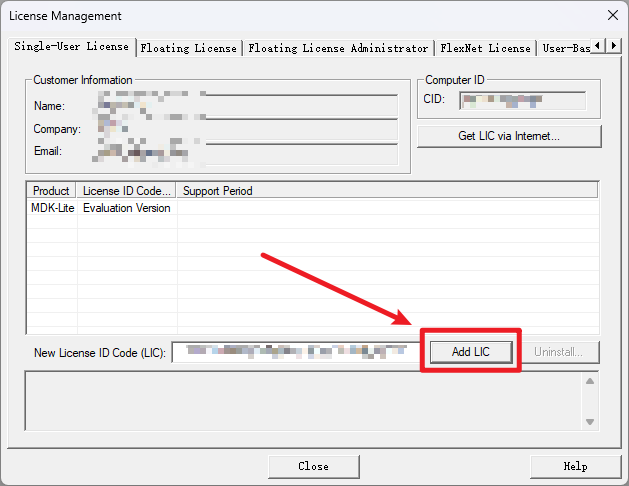

## 下载固件包

1. 在Keil主界面中，单击打开【Pack Installer】；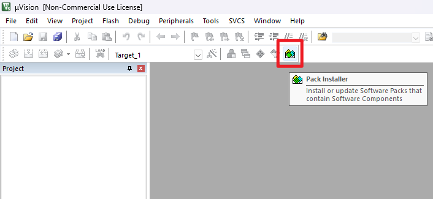
::: tip
可能需要等待一段时间才能完全加载。
:::
2. 依据你使用的芯片型号，选择对应的固件包并安装，如图所示`STM32F103C8T6`芯片的选择方法，最后请选择后缀为`_DFP`的包点击旁边的【Install】；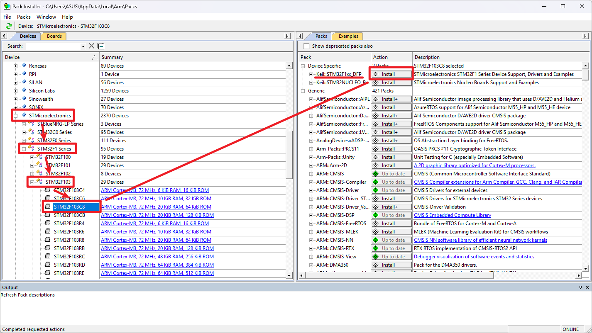
::: tip
安装完成后将显示【Up to date】：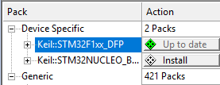

若弹出类似此界面，点击同意后继续：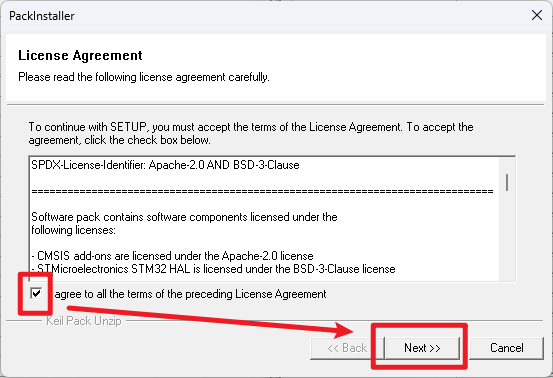

安装完成回到Keil主界面时，将弹出此窗口询问是否重新加载资源包，请选择【是】：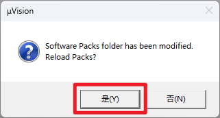
:::
3. 至此我们完成了固件包的安装，这次新建工程时就会有相关固件了！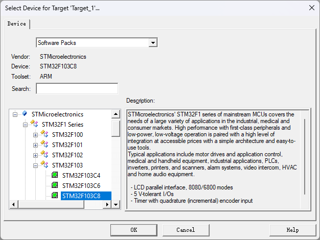

## 修复 ARM Compiler Version 5

> 一些旧版教程中的提供例程代码（例如江协科技）无法在最新的 ARM Compiler Version 6 中通过编译，而最新版的 Keil uVision5 也不会帮我们安装 ARM Compiler Version 5，因此我们需要自行对其进行修补。
>
> 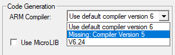
> 
> 如果你发现你导入的例程出现了莫名其妙的报错，不妨试试本节教程将默认编译器改为 ARM Compiler Version 5！

1. 首先我们需要确定你的Keil的安装位置，右键快捷方式，点击【打开文件所在的位置】；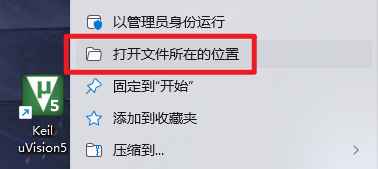
2. 接着，切换到上一级文件夹`Keil_v5`的另一级文件夹`ARM`下，在这里新建一个文件夹，命名为`ARMCC`,点进去，复制此时的文件夹路径；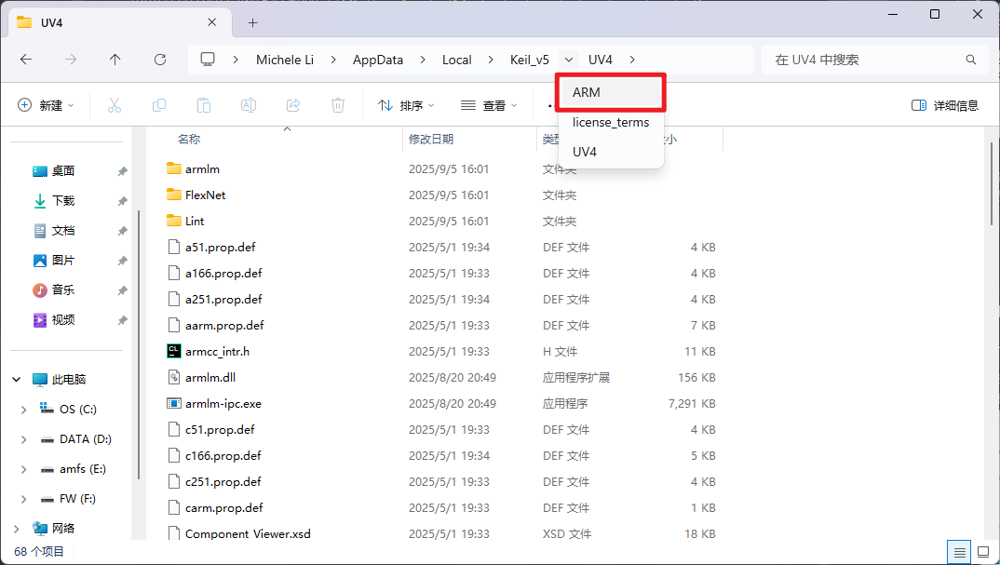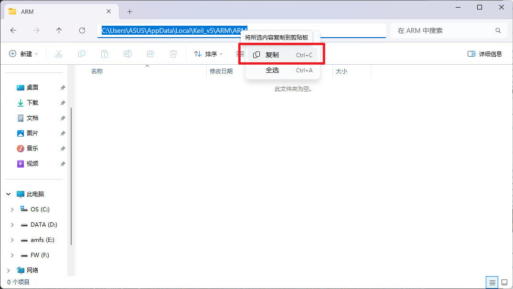
3. [点击这里](https://wwab.lanzouw.com/iu4IM35mxg6b)下载 ARM Compiler Version 5 安装包，将其解压；
4. 双击`setup.exe`启动安装程序；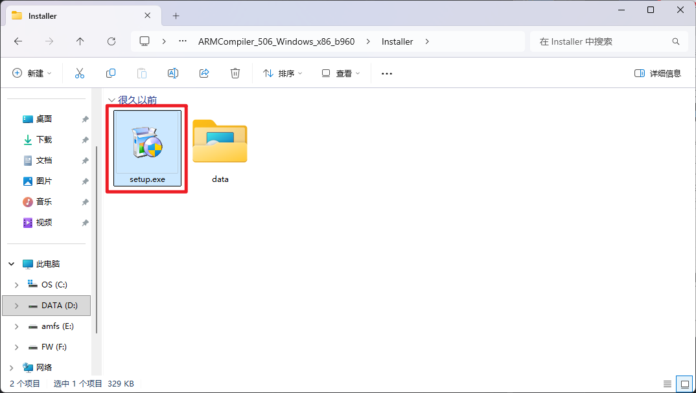
5. 一路确认直到进行到此步骤，点击【Browse...】；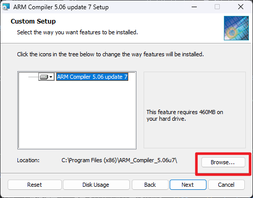
6. 在【Folder Name】中粘贴你刚刚复制的路径，点击【OK】，回到上一个界面后，点击【Next】，并确认开始安装；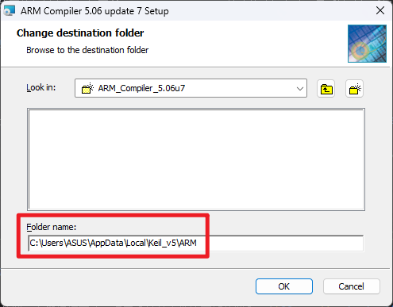
::: warning
此处图中输入的路径有误，正确的应为`C:\Users\ASUS\AppData\Local\Keil_v5\ARM\ARMCC`。

本提示仅纠正图片中的勘误，实际操作中你的路径可能会与之不同，**请勿直接复制上方路径填入**！
:::
7. 安装完成，可以关闭本程序了，接下来请回到Keil；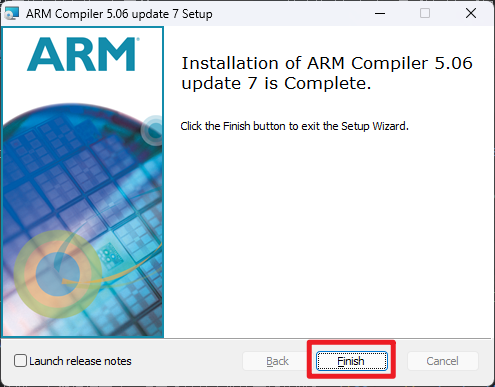
8. 点击打开【Manage Project Items】，切换到【Folders/Extensions】选项卡下，点击【Use ARM Compiler】右侧的【...】；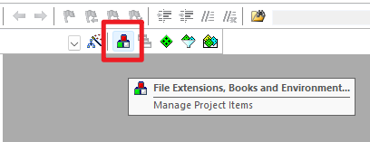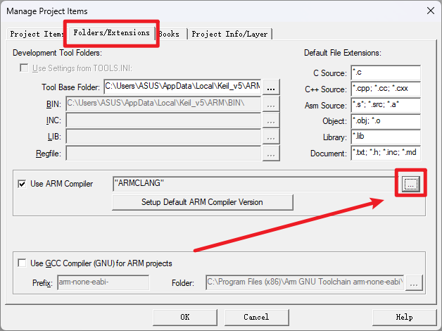
9. 点击【Add another ARM Compiler Version to List...】，在弹出的选择窗口中直接将你刚刚复制的路径粘贴进来，并【确定】；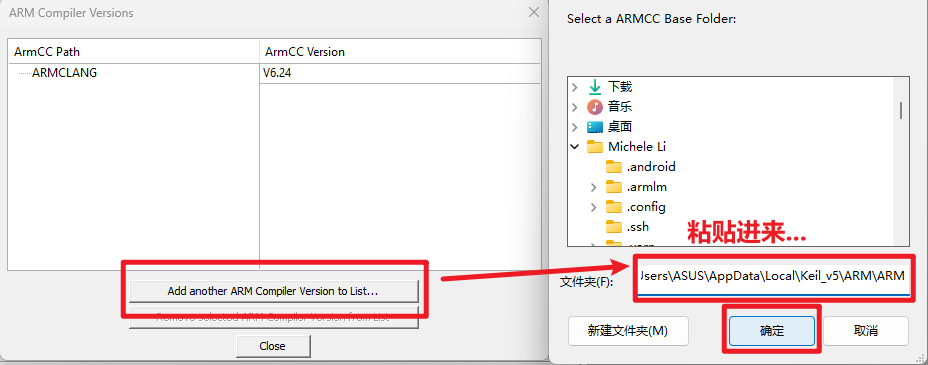
10. 如果没问题的话，一个新的编译器【V5.06 update 7 (build 960)】将会出现在列表中；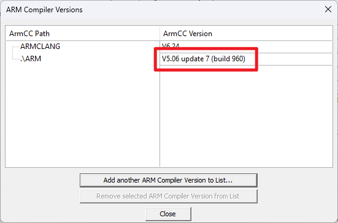
11. 一路确认回去，现在你已经可以选择 ARM Compiler Version 5 了！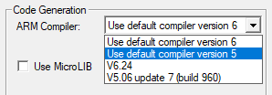
