# STM32CubeIDE

> **Why STM32CubeIDE?**
>
> STM32CubeIDE是一体式多操作系统开发工具，是STM32Cube软件生态系统的一部分。STM32CubeIDE集成了STM32CubeMX的STM32配置与项目创建功能，以便提供一体化工具体验，并节省安装与开发时间。(≧∇≦)ﾉ

## 软件安装

::: danger 注意注意！
最近，ST 发布了`STM32CubeIDE 2.0.0`版本，该版本在新建工程的结构上发生了巨大的改动，且移除了内置的`STM32CubeMX`，导致我们还需要额外再安装`STM32CubeMX`，具体安装方法请参考[这里](/教程/正文/IDE/VSCode.md#stm32cubemx)。

请在完成了**最新版**的`STM32CubeMX`安装后，再进行下一步~
:::

1. 点击[这里](https://www.st.com.cn/zh/development-tools/stm32cubeide.html)进入官网,并点击【获取软件】；
2. 点击对应系统（Linux/Windows）的【获取最新版本】，并【接受】许可协议；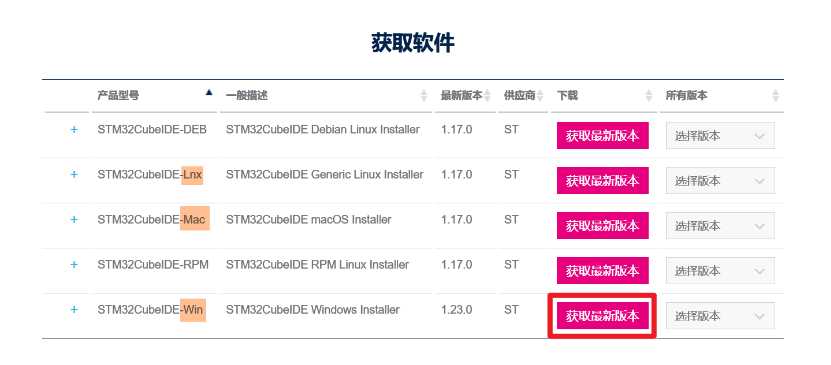
3. 若弹出此窗口，则【创建MyST账户】；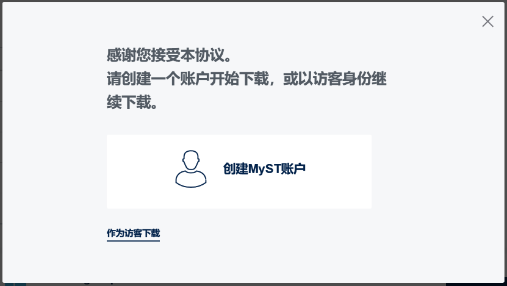
::: danger
**输入信息时，务必填写正确的电子邮箱以接收验证码！不要跳过此步骤！**  
如果已有账号的话，就直接登录吧！
:::
4. 登录账号后再次尝试下载（官网链接下载文件格式为.zip压缩文件，文件大小如图所示）;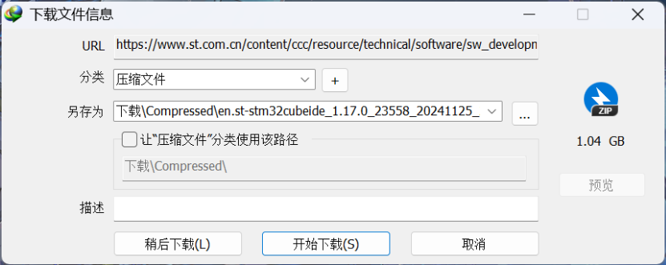
::: tip
如果觉得下载速度过慢可[点此（使用国内镜像源加速）](https://pan.baud-dance.com/d/STM32CubeIDE/st-stm32cubeide_1.18.0_24413_20250227_1633_x86_64.exe)下载
:::
5. （若官网下载则先解压出软件安装包）双击.exe文件以开始软件安装，安装包必须放在在全英文路径下；
6. 一路【Accept】和【Next】，安装选项保持默认即可，安装路径**建议不选C盘**；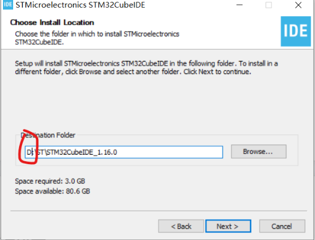
7. 【Finish】！安装完成啦~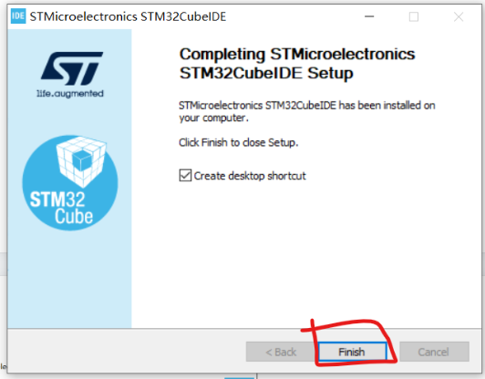

## “包”安装-创建你的第一个工程

> 包，也就是Pack，是用于对某个系列芯片的代码生成、编译的重要文件，接下来通过创建第一个工程来顺便安装Pack。(o゜▽゜)o☆

1. 双击桌面图标以启动软件；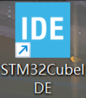
   ::: tip
   若无法在桌面上找到图标，也可尝试在“开始”菜单中检索首字母“S”或直接搜索来找到CubeIDE软件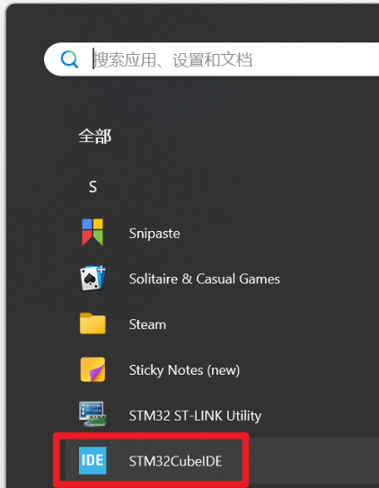
   :::
2. 首次启动时，弹出对话框，请指定一个【工作空间】；
   ::: tip
   工作空间：存放你的项目（代码，项目配置文件，编译文件等的集合）的文件夹，即你想把工程存储的地方。
   :::
   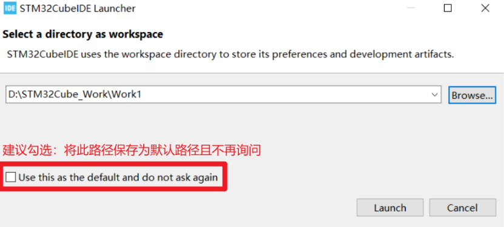
3. 启动`STM32CubeMX`，点击如图所示按钮以新建工程；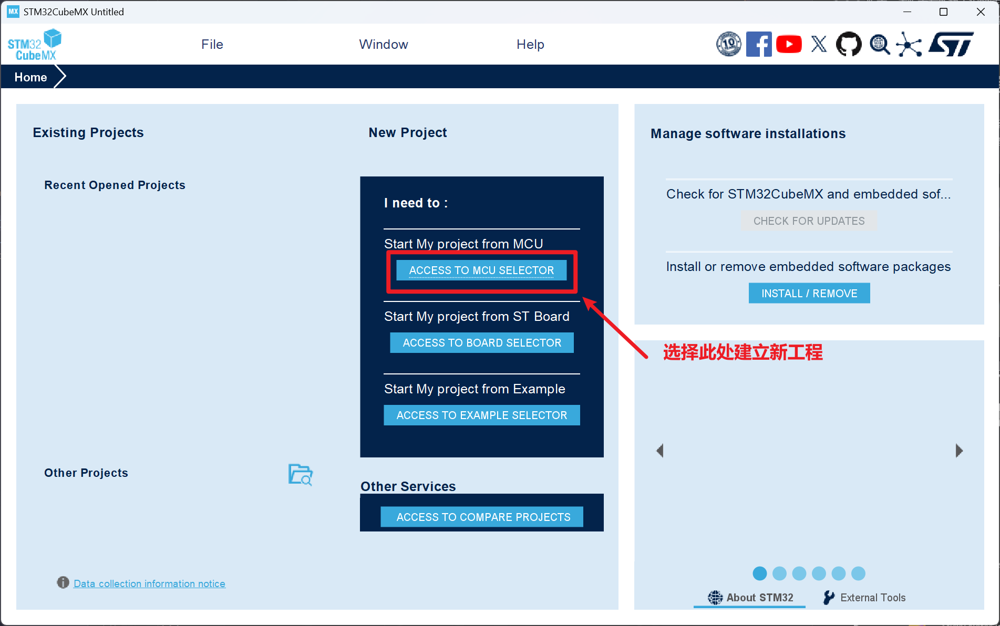
4. 在弹出的窗口中，选择你想要创建的工程的芯片型号，若是dji-C板则输入`STM32F407IGH6`，完成后点击右上角的【Start Project】蓝色按钮，即可完成工程创建；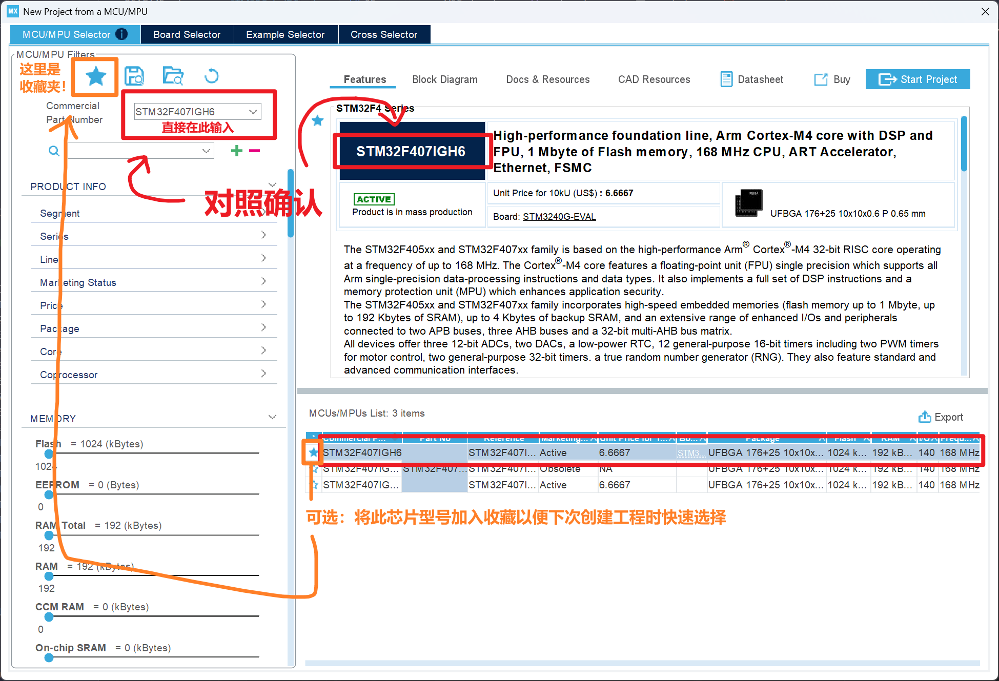
5. 接下来即可开始配置项目，基本配置方法请参照[【项目基本配置】](/教程/正文/IDE/STM32CubeIDE.md#项目基本配置)一节，现在视为你已经完成项目配置，也可以暂时跳过配置，继续教程；
6. 点击【Software Packs】→【Manage Software Packs】，进入“包下载”页面；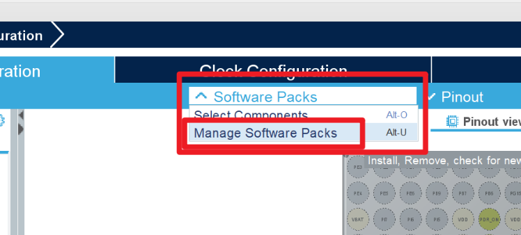
7. 确认芯片型号（dji-c板是f407,即f4系列），并安装最新版软件包（未来若使用其他系列芯片如f1，h7系列等也如此操作）；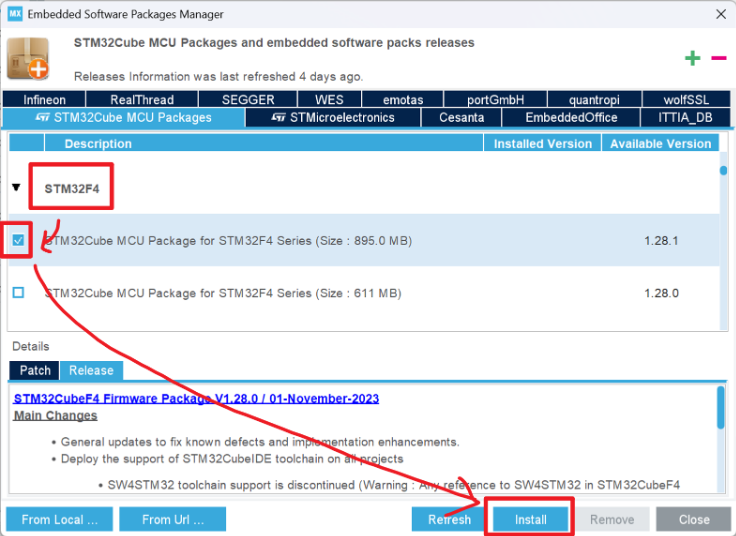
8. 等待下载完成即可，遇到确认协议等直接Agree继续，复选框变为绿色即为安装成功；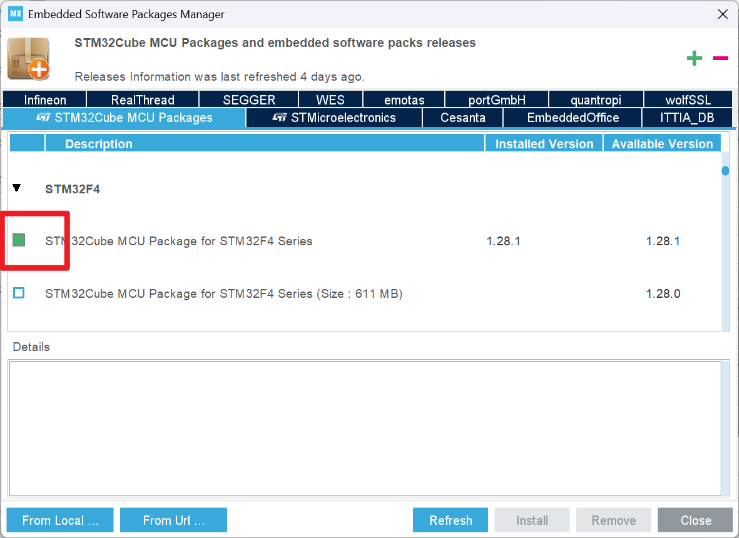
9. 切换到【Project Manager】选项卡下，设置工程名、保存路径，注意【Toolchain/IDE】请务必选中【STM32CubeIDE】，确认无误后即可生成代码；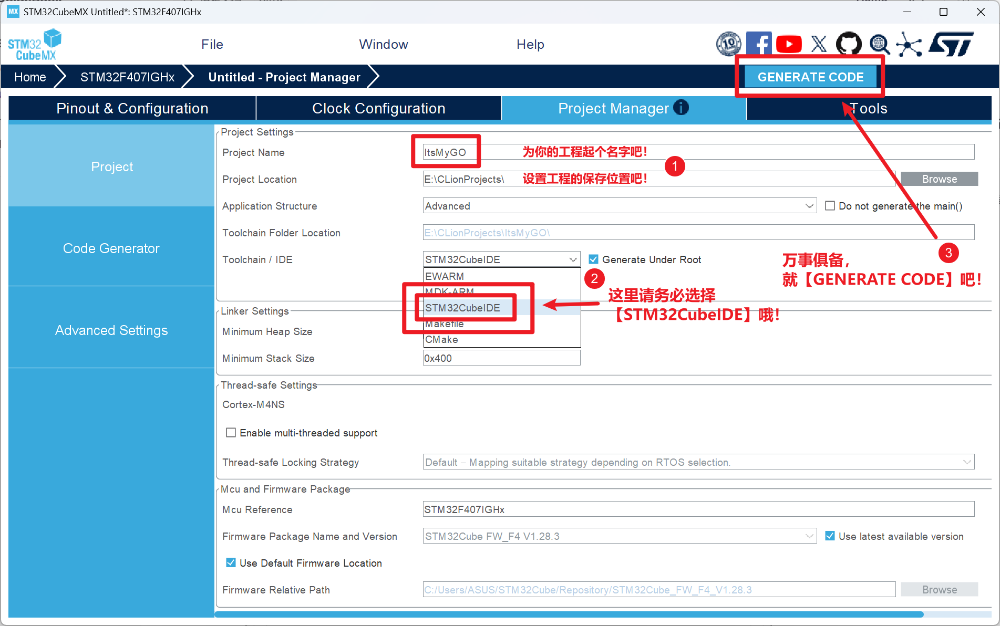
10. 第一次创建工程需要等待较长时间，弹出此窗口即代表创建完成，此时可以点击【Open Project】，让CubeIDE自动导入你创建的工程；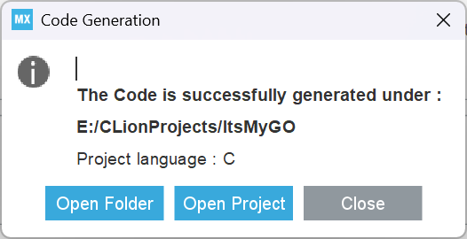
11. 如果CubeIDE尚未启动，将会自动启动，出现此窗口即代表导入成功，你可以在【项目资源管理器】中看见它，至此我们成功创建了第一个工程并生成了基础代码；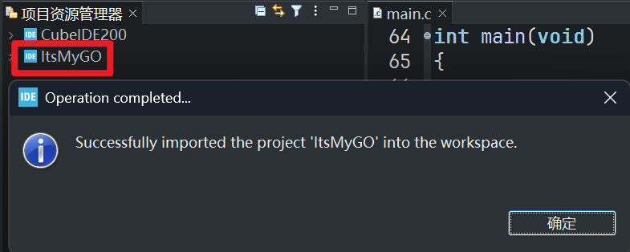

    ::: details 如果你并没有点击【Open Project】，或者导入失败了...

    **手动导入CubeMX工程**

    - 点击导航栏左上角的【File】→【STM32 Project Create/Import】；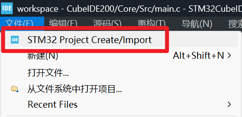
    - 在打开的向导窗口中，选择图示选项，并【下一步】；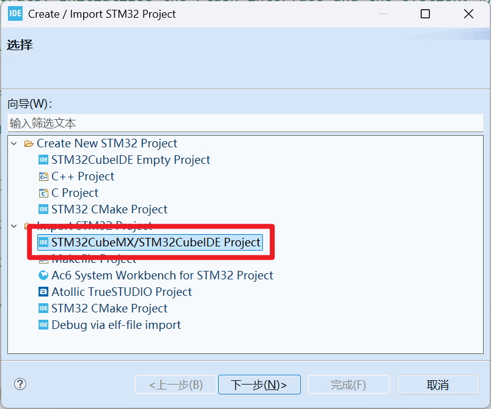
    - 在导入项目向导中，【导入源】选择【目录】，并进入你刚刚创建的**工程**的那个文件夹，而不是存放工程的文件夹。需要注意的是，请确保你的文件夹名为你刚刚创建的工程名，且文件夹内仅有示例图中所示的几个文件夹；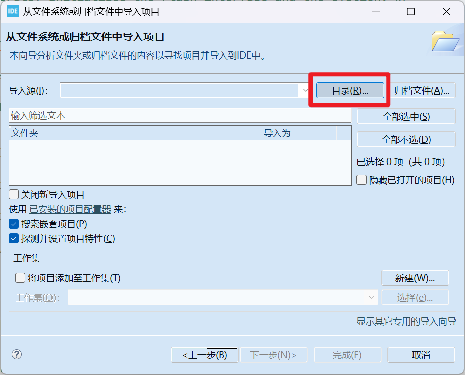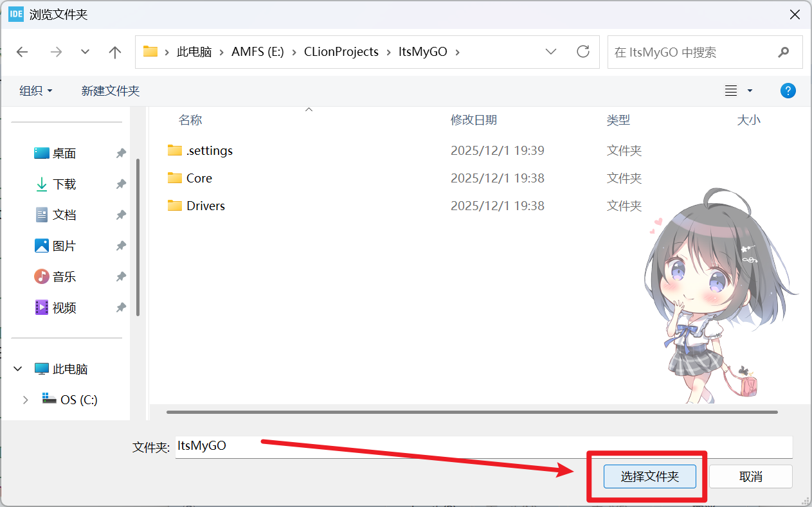
    - 之后，将文件夹全部选中（一般会默认全选）后，【完成】导入；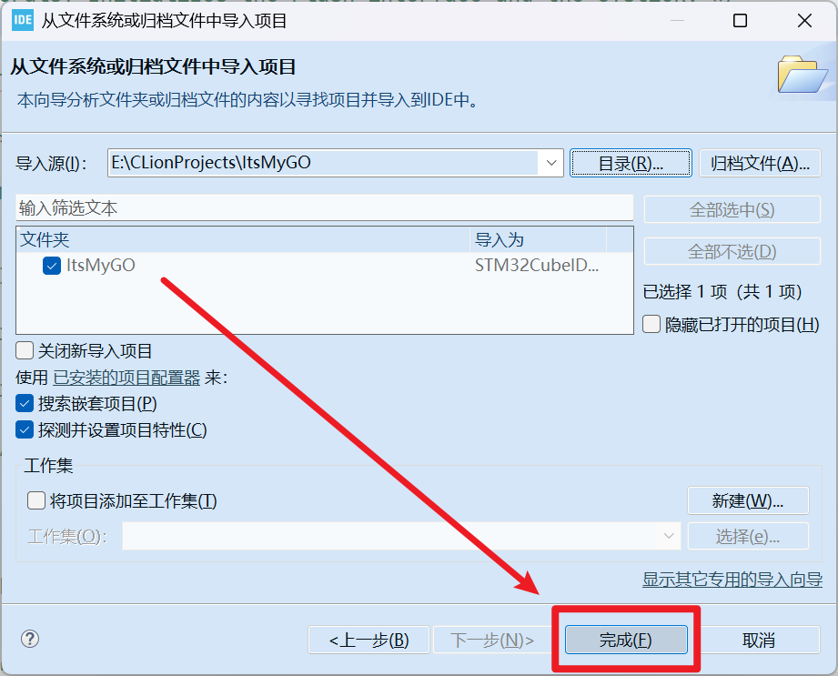
    :::

## 软件汉化

> 虽然道理我都懂，但英文界面看着总是不太习惯呢...(っ °Д °;)っ

1. 根据下图依次点击，进入“软件安装”界面；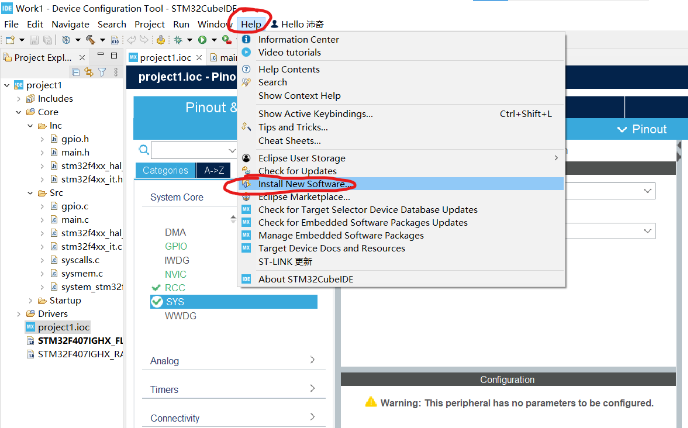
2. 在下图所示输入框中输入以下网址并回车：

~~~txt
https://download.eclipse.org/technology/babel/update-site/latest/
~~~

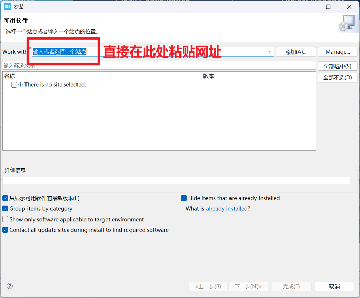
::: warning
**若从此处开始直至本小节结束的任何一个步骤中等待时间过长（超过15分钟）或直接报错，则考虑：更换下载时段/更换网络连接/使用魔法**
:::
3. 选择简体中文（全选），并【安装】；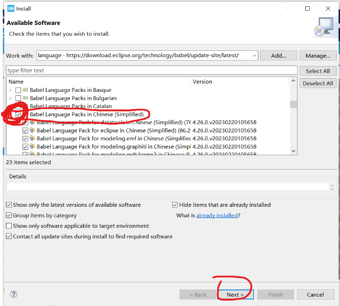
4. 点击【Next】，同意协议后【Finish】；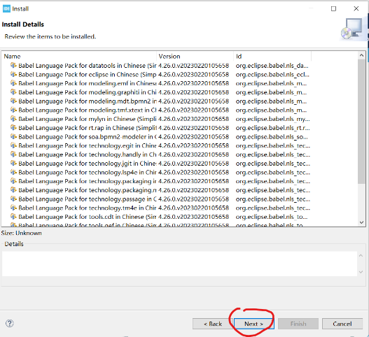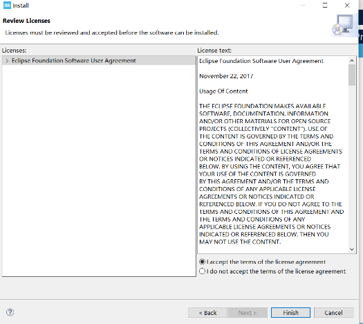
   ::: tip
   可以点击右下角【进度】按钮来查看安装总体进度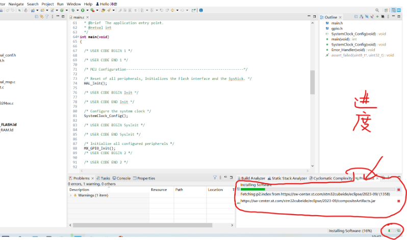
   :::
5. 中途会弹出是否信任来源的弹框，勾选全部后信任；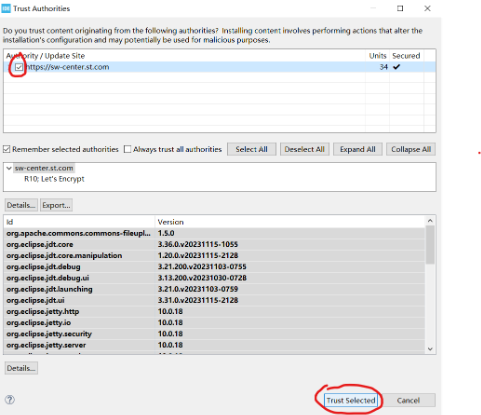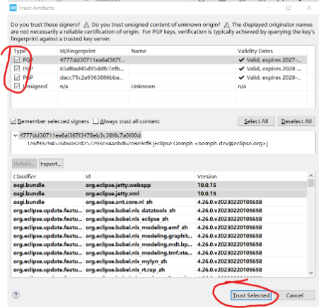
6. 最后提示我们重启；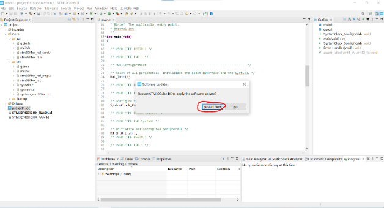
7. 重启后，IDE汉化完成~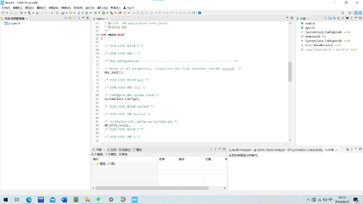
> ~~这下舒服多了\(0^◇^0)/~~

## 项目基本配置

> 这是开启任何项目前的“起手式”哦，请务必牢记～**以后的所有配置教程及代码教程都将默认你已无误完成本小节的基本配置！**╰(\*°▽°\*)╯

1. 双击.ioc文件打开CubeMX界面，按照下图所示方法，在【System Core】中设置高速外部时钟源为晶振，设置Debug为Serial Wire；
   ::: tip
   可不设置低速时钟为晶振。
   :::
   ::: tip
   如果CubeMX已经打开，则无需再双击，直接切换窗口即可。
   :::
   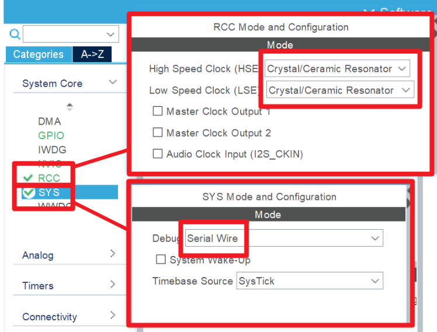
2. 按照下图所示顺序配置时钟，配完后可与图片对照是否一致；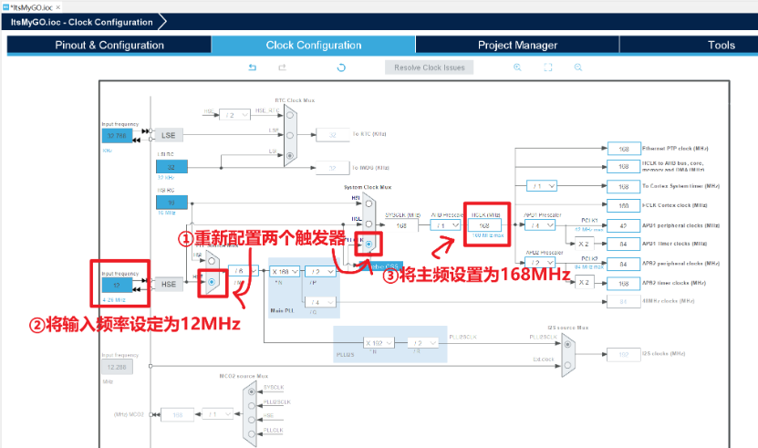
   ::: tip
   若在进行图中第③步时弹出切换时钟源的确认提示，请选择【OK】；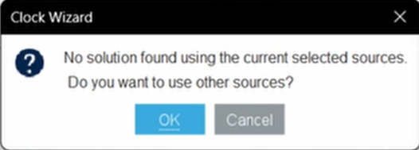
   :::
3. 在【Project Manager】→【Code Generator】中，勾选“为每个外设生成单独的.c/.h文件”；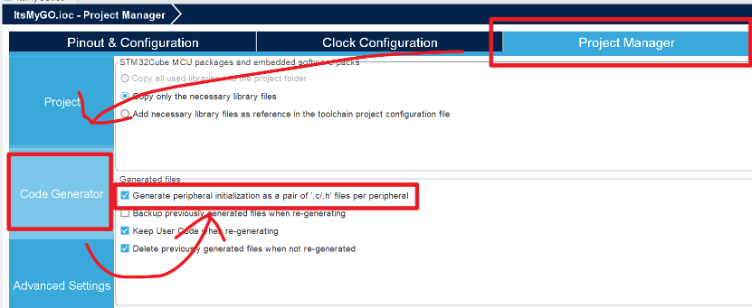
4. 最后【GENERATE CODE】生成代码~

~~现在请开始你的表演~~

## 使用DAP-Link下载、调试程序到单片机

> 是没见过的下载器呢...ヾ(•ω•`)o

1. 先点击页面左上角的小锤子对当前代码进行编译，无报错即可进行下一步；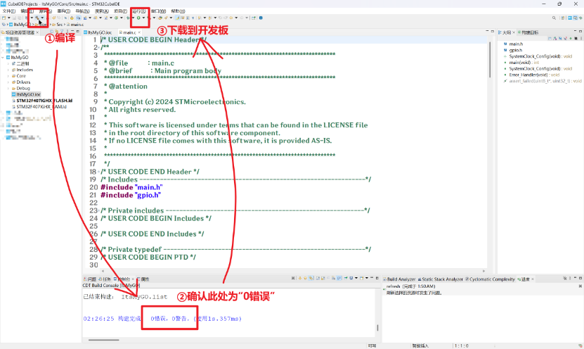
::: tip
CubeIDE中还存在另一种按钮风格，此时对应的按钮如图所示: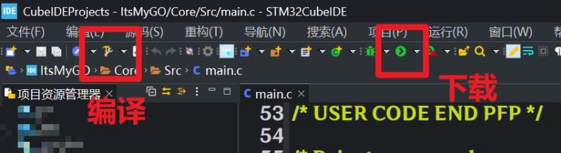
:::
2. 首次下载时，需要按照下图所示方法配置下载器；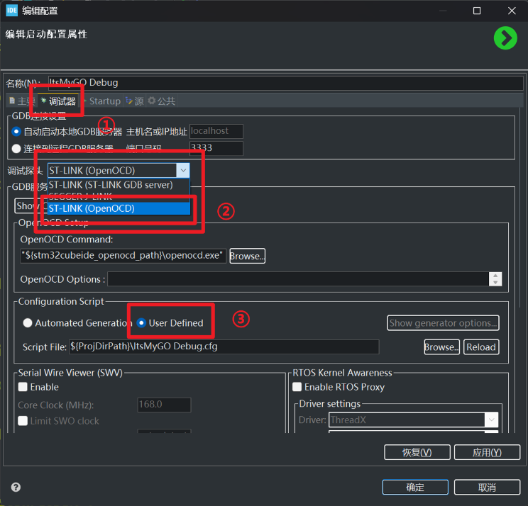
3. 点击【确定】，让CubeIDE自动为我们生成烧录配置，然后应该会报错；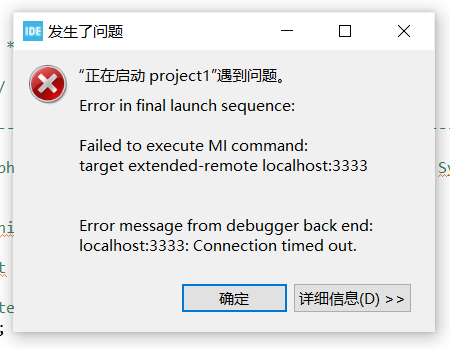
::: info
这是计划的一部分，其目的主要是让CubeIDE生成烧录配置。
:::
4. 双击工程中的.cfg文件，更改烧录配置；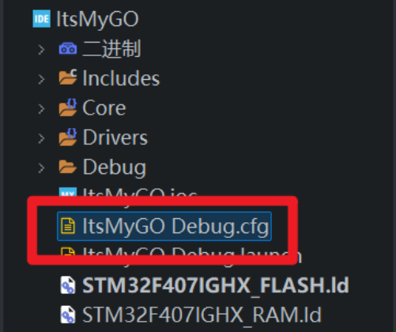
   ::: details 如果你的电脑打开了如VSCode之类的其他编辑器...

   **设置文件的默认打开方式**

   - 在.cfg文件上右键→打开方式→其他...；
   - 选择【内部编辑器】→【通用编辑器】后，勾选【所有“*.cfg“文件使用它】，【确定】；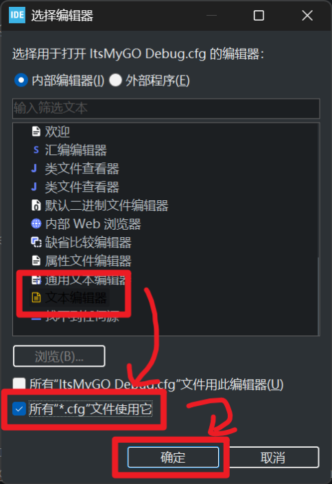
   :::

5. 将.cfg文件按照如下方式修改：
   - 修改第6行：`source [find interface/stlink-dap.cfg]` 为`source [find interface/cmsis-dap.cfg]`；
   - 修改第11行：`transport select "dapdirect_swd"` 为 `transport select "swd"`；
   - 修改第28行：`reset_config srst_only srst_nogate connect_assert_srst` 为 `reset_config none`；

   修改后的文件看起来像这样：
   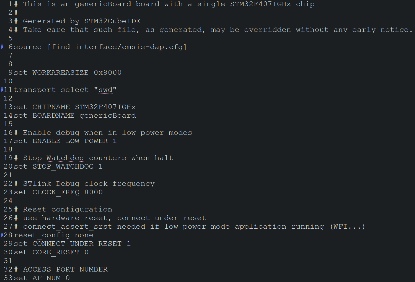
6. 此时再次下载，就可以成功下载代码到开发板啦~
::: info
若此步还是未成功，在确认上述没有任何重要步骤跳过后，再找学长装驱动。
:::
::: tip
在大多数情况下【下载】操作中已经包括了【编译】操作，因此写完代码后，也可以直接点击【下载】而无需【编译】。若非如此，则需要在【编译配置】中手动设置下载前自动编译。
:::
