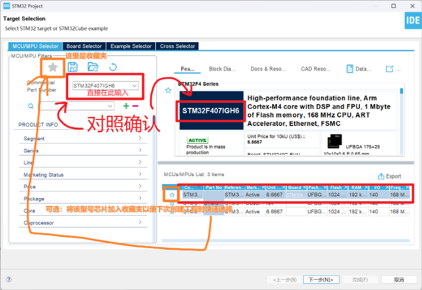
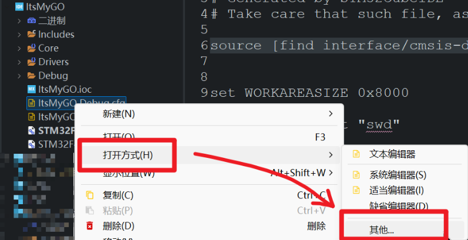

# STM32CubeIDE
> **Why STM32CubeIDE?**
>
> STM32CubeIDE是一体式多操作系统开发工具，是STM32Cube软件生态系统的一部分。STM32CubeIDE集成了STM32CubeMX的STM32配置与项目创建功能，以便提供一体化工具体验，并节省安装与开发时间。(≧∇≦)ﾉ

## 软件安装

1. 点击[这里](https://www.st.com.cn/zh/development-tools/stm32cubeide.html)进入官网,并点击【获取软件】；
2. 点击对应系统（Linux/Windows）的【获取最新版本】，并【接受】许可协议；
3. 若弹出此窗口，则【创建MyST账户】，**记住创建好的账户备用**；
::: danger
**输入信息时，务必填写正确的电子邮箱以接收验证码！不要跳过此步骤！**  
如果已有账号的话，就直接登录吧！
:::
4. 登录账号后再次尝试下载（官网链接下载文件格式为.zip压缩文件，文件大小如图所示）;
::: tip
如果觉得下载速度过慢可[点此（使用国内镜像源加速）](https://pan.baud-dance.com/d/STM32CubeIDE/st-stm32cubeide_1.18.0_24413_20250227_1633_x86_64.exe)下载
:::
5. （若官网下载则先解压出软件安装包）双击.exe文件以开始软件安装，安装包必须放在在全英文路径下；
6. 一路【Accept】和【Next】，安装选项保持默认即可，安装路径**建议不选C盘**；
7. 【Finish】！安装完成啦~

## “包”安装-创建你的第一个工程
> 包，也就是Pack，是用于对某个系列芯片的代码生成、编译的重要文件，接下来通过创建第一个工程来顺便安装Pack。(o゜▽゜)o☆

1. 双击桌面图标以启动软件；
   ::: tip
   若无法在桌面上找到图标，也可尝试在“开始”菜单中检索首字母“S”或直接搜索来找到CubeIDE软件
   :::
2. 首次启动时，弹出对话框，请指定一个【工作空间】；
   ::: tip
   工作空间：存放你的项目（代码，项目配置文件，编译文件等的集合）的文件夹，即你想把工程存储的地方。
   :::
   
3. 根据下图说明，打开登录ST账号的窗口，随后在弹出的窗口中登录你刚刚在ST官网注册的MyST账号，若窗口关闭且未出现任何报错，则代表成功登录；
   ::: warning
   **请勿跳过此步骤！**
   :::
4. 新建一个工程（一个完整的单片机程序外加配置文件等等...）；
5. 输入单片机型号，若是dji-C板则输入STM32F407IGH6；
6. 为工程命名，确认无误后【Finish】,第三个一定要选择STM32Cube，若无法选中则退出软件重进；
   ::: tip
   无需点击【下一步】
   :::
7. 修改软件包(Pack)存储路径：
   ::: tip
   接下来你需要下载的软件包将默认保存在C盘，但我们可以修改软件的安装路径，若不想修改可跳过本段；
   :::
    1. 完成工程创建后，IDE会自动打开CubeMX（代码生成器）界面，单击选项卡上的“×”暂时将其关闭；**请勿跳过此步骤！**
    2. 依次点击Window→Preference；
    3. 依次点击，在【Repository Setup】中，填写或浏览你想要存放软件包的文件夹,建议放在STM32CubeIDE的安装路径下以便于管理；
8. 在左侧的【项目资源管理器】中，双击与你刚刚创建的工程同名的.ioc文件，打开CubeMX界面；
9. 点击Software Packs→Manage Software Packs，进入“包下载”页面；
10. 确认芯片型号（dji-c板是f407,是f4系列），并安装最新版软件包（未来若使用其他系列芯片如f1，h7系列等也如此操作）；
11. 等待下载完成即可，遇到确认协议等直接Agree继续；
    ::: tip
    复选框变为绿色即为安装成功；
    :::
12. 安装完回到CubeMX页面，按下**Ctrl+S**即可保存并生成代码，若遇到下面两个提示，此时请按照下图说明，勾选复选框并Yes；
13. 至此我们成功创建了第一个工程并生成了基础代码；

## 软件汉化
> 虽然道理我都懂，但英文界面看着总是不太习惯呢...(っ °Д °;)っ

1. 根据下图依次点击，进入“软件安装”界面；
2. 在下图所示输入框中输入以下网址并回车：
~~~
https://download.eclipse.org/technology/babel/update-site/latest/
~~~

::: warning
**若从此处开始直至本小节结束的任何一个步骤中等待时间过长（超过15分钟）或直接报错，则考虑：更换下载时段/更换网络连接/使用魔法**
:::
3. 选择简体中文（全选），并【安装】；
4. 点击【Next】，同意协议后【Finish】；
   ::: tip
   可以点击右下角【进度】按钮来查看安装总体进度
   :::
5. 中途会弹出是否信任来源的弹框，勾选全部后信任；
6. 最后提示我们重启；
7. 重启后，IDE汉化完成~
> ~~这下舒服多了\(0^◇^0)/~~

## 项目基本配置
> 这是开启任何项目前的“起手式”哦，请务必牢记～**以后的所有配置教程及代码教程都将默认你已无误完成本小节的基本配置！**╰(\*°▽°\*)╯

1. 双击.ioc文件进入CubeMX界面，按照下图所示方法，在【System Core】中设置高速外部时钟源为晶振，设置Debug为Serial Wire；
   ::: tip
   可不设置低速时钟为晶振。
   :::
   
2. 按照下图所示顺序配置时钟，配完后可与图片对照是否一致；
   ::: tip
   若在进行图中第③步时弹出切换时钟源的确认提示，请选择【OK】；
   :::
3. 在【Project Manager】→【Code Generator】中，勾选“为每个外设生成单独的.c/.h文件”；
4. 最后按下Ctrl+S保存并生成代码~

~~现在请开始你的表演~~

## 使用DAP-Link下载、调试程序到单片机
> 是没见过的下载器呢...ヾ(•ω•`)o

1. 先点击页面左上角的小锤子对当前代码进行编译，无报错即可进行下一步；
::: tip
CubeIDE中还存在另一种按钮风格，此时对应的按钮如图所示:
:::
2. 首次下载时，需要按照下图所示方法配置下载器；
3. 点击【确定】，让CubeIDE自动为我们生成烧录配置，然后应该会报错；
::: info
这是计划的一部分，其目的主要是让CubeIDE生成烧录配置。
:::
4. 双击工程中的.cfg文件，更改烧录配置；
::: details 如果你的电脑打开了如VSCode之类的其他编辑器...
##### 设置文件的默认打开方式
- 在.cfg文件上右键→打开方式→其他...；
- 选择【内部编辑器】→【通用编辑器】后，勾选【所有“*.cfg“文件使用它】，【确定】；
:::
5. 将.cfg文件按照如下方式修改：
   - 修改第6行：`source \[find interface/stlink-dap.cfg]` 为`source \[find interface/cmsis-dap.cfg]`；
   - 修改第11行：`transport select "dapdirect_swd"` 为 `transport select "swd"`；
   - 修改第28行：`reset_config srst_only srst_nogate connect_assert_srst` 为 `reset_config none`；

   修改后的文件看起来像这样：

6. 此时再次下载，就可以成功下载代码到开发板啦~
::: info
若此步还是未成功，在确认上述没有任何重要步骤跳过后，再找学长装驱动。
:::
::: tip
在大多数情况下【下载】操作中已经包括了【编译】操作，因此写完代码后，也可以直接点击【下载】而无需【编译】。若非如此，则需要在【编译配置】中手动设置下载前自动编译。
:::
