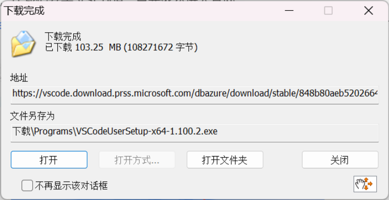
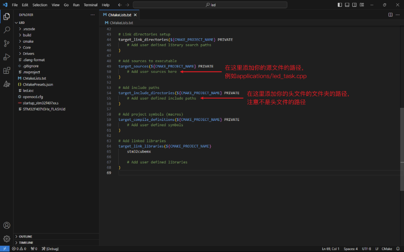

# VSCode+STM32CubeMX

::: danger 注意注意！
由于战队现已改用CLion作为队内统一IDE，本节现已不再更新/维护。请转到[CLion+STM32CubeMX](/教程/正文/IDE/CLion.md)
:::

::: danger 2025/8/19更新
此处记录的VSCode配置环境**已过时**，官方已更新最新的一站式安装工具链，Release中打包的环境配置已经删除，请不要继续使用。
:::

> **Why VSCode?**
>
> 使用STM32CubeMX + VSCode进行日常开发，相比于使用CubeIDE，你可以得到：
>
> 1. 更加简洁现代的图形化界面；
> 2. 更加完善的社区和插件支持，更好地与git联动；
> 3. 软件使用过程中几乎不会出现任何恶性BUG，微软亲儿子；
> 4. 更高的自由度，适合平时习惯使用VSCode开发的同学使用；
>
> 但与此同时...你将会：
>
> 1. 调试过程中无法使用Live Expressions（现场表达式），这意味着你无法在IDE内部的调试界面动态观测变量值；
> 2. 每次都有点麻烦的需要手动初始化工程；

## 工具链与软件安装

### STM32CubeMX

> STM32CubeMX是一种图形工具，通过分步过程可以非常轻松地配置STM32微控制器和微处理器，以及为Arm® Cortex®-M内核或面向Arm® Cortex®-A内核的特定Linux®设备树生成相应的初始化C代码。

1. 首先，来安装代码生成器STM32CubeMX吧！[点击此处](https://www.st.com.cn/zh/development-tools/stm32cubemx.html)进入官网,并点击【获取软件】，再根据自己电脑的系统，点击【获取最新版本】；
2. 接受协议，账号的注册或登录步骤几乎与[STM32CubeIDE的教程](/教程/正文/IDE/STM32CubeIDE.md)相同，随后开始下载；
3. 将安装程序解压出来，运行它，并按照推荐默认设置一路Next，便可以安装完成。

### STM32CubeCLT

> STM32CubeCLT是一套由ST公司**为用户打包好的一整套嵌入式编程工具链**，包括CMake、Ninja、Arm-GCC和STLink等，方便了统一管理与用户调用。

1. 点击此处进入官网，下载安装的步骤几乎都与[STM32CubeMX的教程](/教程/正文/IDE/VSCode#stm32cubemx)相同~
2. 安装完成后，可以使用命令行检查工具链是否正确安装；

::: details 如何做？

1. 打开【终端】（系统自带软件），并创建PowerShell选项卡；
2. 在窗口中依次输入下面三条命令：

    ```sh
    cmake --version
    ninja --version
    arm-none-eabi-gcc --version
    ```

    若每一条命令都成功打印了版本信息，则代表安装成功：
:::

### OpenOCD

> **Why OpenOCD?**
>
> 使用DAP-Link进行代码烧录或调试时需要此工具链，但由于其并不包含在STM32CubeCLT中，因此需要额外安装。

1. [点击此处](https://gnutoolchains.com/arm-eabi/openocd/)进入官网下载**最新版**压缩包，将其解压至C盘根目录（或其它**非常便于管理**且不会误删的目录）；
2. 将其文件夹内【bin】文件夹的路径地址复制下来备用；
3. 将该路径地址添加进**系统变量**Path下，如果有的话记得删除复制路径时自带的双引号；
::: details 系统变量是啥？它在哪？

> 系统变量是环境变量的一种（Path），环境变量是 Windows 系统中一组用来告诉电脑该怎么工作的配置信息，它们像“指路牌”一样，帮助程序找到需要的文件或工具。比如，当你在命令行中输入程序名时，系统会根据环境变量里的信息去特定的路径里查找那个程序。可以把环境变量理解为电脑运行程序时用到的一些“提示信息”。

#### 方法一：直接搜索

1. 按下系统快捷键Win+S，搜索环境变量，打开它；
2. 在弹出的窗口中，点击【全局变量】；
3. 在【系统变量】中向下翻找，找到Path，双击编辑，即可在打开的窗口中【新建】路径了；

#### 方法二：我键盘坏了

1. 打开系统设置；
2. 转到【系统】→【系统信息】；
3. 点击【高级系统设置】，即可打开`方法一`第2步中的窗口了；
:::
4. 安装完成后，可以使用命令行检查工具链是否正确安装；

::: details 如何做？

1. 打开【终端】（系统自带软件），并创建PowerShell选项卡；
2. 在窗口中依次输入以下命令：

    ```sh
    openocd --version
    ```

   若成功打印了版本信息，则代表安装成功：
:::

### VSCode

> VS Code（全称 Visual Studio Code）是一款由微软推出的免费、开源、跨平台的代码编辑器，其支持 Windows、macOS 和 Linux，拥有强大的功能和灵活的扩展性。

1. 首先依然[点击此处](https://code.visualstudio.com/)进入官网，点击中间最显眼的那个【下载】按钮吧；
2. 打开安装程序后，保持默认（推荐）设置，**直到此处需要确保所有的勾都勾选上**，再继续安装步骤；
3. 安装完成后，启动VSCode，来到左侧【插件】选项卡下，安装如下插件：

   ```txt
   STM32Cube for Visual Studio Code
   中文（简体）语言包    // 可选安装
   ```

   注意，你在安装`STM32Cube for Visual Studio Code`时，需要点击旁边的下拉菜单，选择“安装预发布版本”，这样，才能安装最新版STM32插件捆绑的**一大堆**扩展插件；

::: details 如果你已经安装了VSCode，甚至用它进行其他技术栈的开发
可以在左下角设置处新建配置文件，防止插件之间相互干扰！
:::

## 工程生成的配置

1. 现在你可以在STM32CubeMX中正常进行芯片选型及引脚/中间件配置，但在使用STM32CubeMX生成项目时，**请将工具链选择为CMake**；

   :::tip
   STM32CubeMX的芯片选型，基础配置与[STM32CubeIDE](/教程/正文/IDE/STM32CubeIDE#项目基本配置)完全一致哦！
   :::

2. 将本Github仓库下的文件夹[`VSCode_dev_env`(点击下载)](https://github.com/SUT-DTS/SUT-DTS.github.io/releases/download/Ver.CH1.10-B/VSCode_dev_env.zip)中的所有文件复制进你的工程内；
3. 复制完后，在工程文件夹空白区域内**右键**，选择【通过Code打开】；
4. 首次打开VSCode时，上方会弹出配置预设的选择，请选择【Debug】；
::: tip
如果错过了第4步，请使用`Ctrl+Shift+P`快捷键，输入`cmake: select configure preset`，即可回到第4步。
:::
5. 接下来，你可以...
   - 使用快捷键进行老三样操作：`F5`调试，`F7`编译，`Ctrl+Shift+B`烧录；
   - 在`openocd.cfg`中可以配置芯片型号和烧录器种类；
   - 自己创建的源文件和头文件需要在`CMakeLists.txt`中添加；
6. <Badge type="warning" text="可选步骤" />将F8设置为「烧录」的快捷键：
   1. 使用`Ctrl+Shift+P`快捷键，输入`keyboard`，选择下图中的选项：
   2. 把下面内容覆盖到该json文件中（保存后生效）：

   ```json
   [
    {
      "key": "f8",
      "command": "workbench.action.tasks.runTask",
      "args": "OpenOCD: flash"
    }
   ]
   ```
